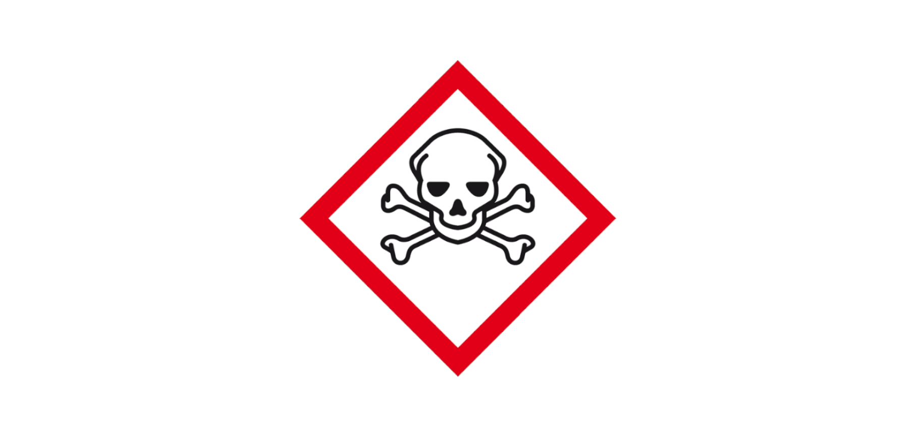

.. title:: OTP-CR-117/19

.. raw:: html

     

.. raw:: html

    
<b>Prosecutor. Court. Reconsider <a href="reconsider.html">OTP-CR-117/19.</a></b>

      
    In 2018 i informed the king of the netherlands that what he calls medicine in
    his laws are not medicine but poison. This makes the care laws used in the netherlands
    not care laws but genocide laws.
      
    "By law, with the use of poison, killing, torturing, castrating, destroying, in whole or in part, all elderly and all handicapped (Wzd), all criminals (Wfz) and all psychiatric patients (WvGGZ) here in the netherlands."
      
    I wrote the prosecutor asking for an arrest of the king (make him stop).
    Prosecutor decided to call it a "no basis to proceed", it requires a
    reconsider of the prosecutor to get the king in his cell and his genocide, thereby, stopped.

.. toctree::
    :hidden:
    :glob:

    evidence
    guilty
    reconsider
    request
    source
    man
    writings
